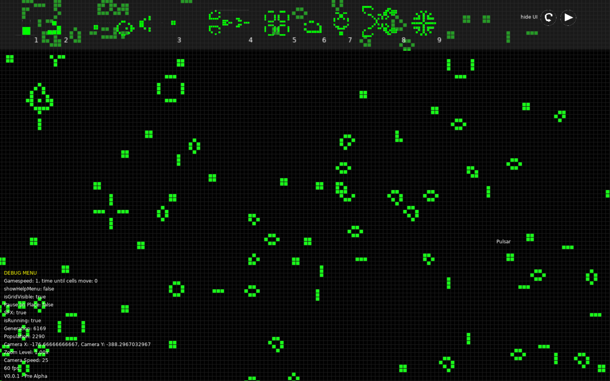

# Game of Life

### Overview

This project is our group's remake of John Conway's Game of Life. We chose to use the love2d game engine for our project. The game works like John's Game of Life is supposed to work but we added some features like sound effects when placing or removing cells, a toolbar where you can select prefabs, speed control and even camera and zoom control to navigate the infinite grid.

### Download Instructions

1. Visit the [Releases](https://github.com/Onomis2/DeepDive-Love2d-Game-of-Life/releases) section of the repository.
2. Download the latest release for your operating system.

### Features

- **Game of Life Ruleset**
- **Infinite Grid**
- **Prefabs**
- **placable and removable cells**
- **Pause/Play Functionality**
- **Speed Controls**
- **Information Logging**
- **Customizable Colors**

### Controls

- **`M1`:** Spawn cell or prefab
- **`M2`:** Remove cell
- **`1 - 9`:** Select prefabs
- **`p`:** Toggle pause on place
- **`space`:** Pause/play the simulation
- **`up` and `down`:** Control simulation speed
- **`c`:** Clear all cells
- **`m`:** Mute/unmute sound effects
- **`t`:** Reset the camera
- **`g`:** Toggle grid visibility
- **`e`:** Cycle through cell colors
- **`b`:** Cycle through background colors
- **`n`:** Toggle help menu
- **`h`:** Toggle debug mode
- **`escape`:** Quit the game

### Authors

- [Simon](https://github.com/Onomis2)
- [Ryan](https://github.com/WElpAztech)
- [Joshua](https://github.com/JoshuaKool)
- [Sytske](https://github.com/Sytske060)
